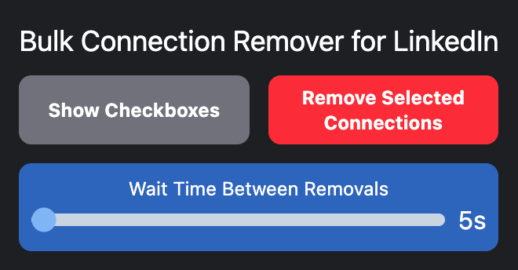
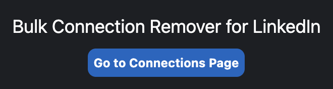

# Bulk Connection Remover for LinkedIn

A Chrome extension that allows you to efficiently remove LinkedIn connections in bulk, directly from the LinkedIn connections page.

---

## Features

* Select multiple LinkedIn connections using checkboxes
* Bulk-remove selected connections with a single action
* Adjustable delay between removals to mimic natural interaction speed
* Built-in safety confirmation before executing deletion
* Quick access to the LinkedIn connections page from the extension popup

---

## How It Works

The extension enhances the LinkedIn **My Network → Connections** page by adding tools for bulk selection and controlled removal of connections.

### 1. Access the Connections Page

If you are not currently on the LinkedIn connections page, the extension popup will display a shortcut button that opens it automatically.

### 2. Enable Selection Mode

On the connections page:

* Click **“Show Checkboxes”** to enable selection mode
* Check the connections you want to remove

### 3. Configure Removal Speed

* Use the **wait time slider** to set the delay between each removal
* This helps simulate natural behavior and reduces the risk of triggering platform limits

### 4. Execute Bulk Removal

* Click **“Remove Selected Connections”**
* A confirmation dialog will appear showing the **total number of selected connections**
* You may cancel or proceed with the action

---

## Important Notes

* Removed connections cannot be restored automatically
* Use responsibly to avoid violating LinkedIn usage limits or policies

---

## Screenshots

<table>
  <tr>
    <td></td>
    <td></td>
  </tr>
  <tr>
    <td align="center">Popup on Connections Page</td>
    <td align="center">Popup on Other Pages</td>
  </tr>
</table>
